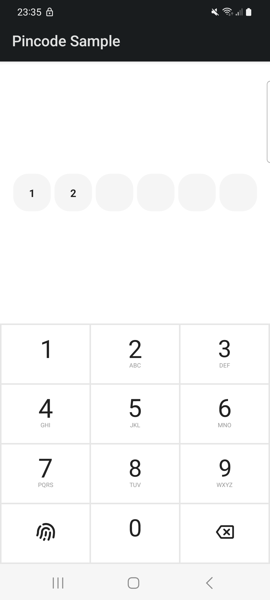

<h1 align="center">Pin Code with Numeric Pad</h1>

<div align="center">
  
</div>
<br>

This repo is a jetpack compose library to ask user for a pin code and display it on boxes.

## Getting Started

Add the following code to your project's _root_ `build.gradle` file:

```groovy
repositories {
    maven { url "https://jitpack.io" }
}
```

Next, add the dependency below to your _module_'s `build.gradle` file:

```gradle
dependencies {
    implementation "com.github.mo0rti:pincode-compose:LATEST_VERSION"
}
```

## Usage

Examples are in the [source code](https://github.com/mo0rti/pincode-compose/blob/main/app/src/main/java/bluevelvet/sample/pincode/MainActivity.kt).

```kotlin
@Composable
fun Usage() {
    var pincode by remember { mutableStateOf("") }

    PinBox(pincode)
    PinPad(pincode) {
        pincode = it.pinCode
        if (it is PinPadResult.EntryFinished) {
            Toast.makeText(this@MainActivity, "Entry finished", Toast.LENGTH_SHORT).show()
            Log.d(tag, "Pincode entry is finished, pincode is $pincode")
        } else {
            Log.d(tag, "Pincode changed to $pincode")
        }
    }
}
```

The default length for pin code is 6. To change it pass the desired length as second parameter to PinBox and PinPad:
```
    ...

    PinBox(pincode, 4)
    PinPad(pincode, 4) {
        ....
    }
    ...

```