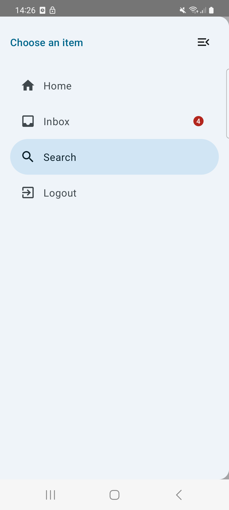

<h1 align="center">Drawer menu</h1>

<div align="center">
  
</div>
<br>

An easy to use drawer mene.

## Usage

Examples are in the [source code](../../example/src/main/java/bluevelvet/composents/example).

```kotlin
    val drawerHomeMenuItem = ComposentsMenuItem(title = "Home", icon = Icons.Filled.Home, id = "home")
    val drawerInboxMenuItem = ComposentsMenuItem(title = "Inbox", icon = Icons.Filled.Inbox, id = "inbox", badgeCount = 4)
    val drawerSearchMenuItem = ComposentsMenuItem(title = "Search", icon = Icons.Filled.Search, id = "search")
    val drawerExitMenuItem = ComposentsMenuItem(title = "Logout", icon = Icons.Filled.ExitToApp, id = "logout")
    val drawerMenuItems = listOf(drawerHomeMenuItem, drawerInboxMenuItem, drawerSearchMenuItem, drawerExitMenuItem)

    var selectedDrawerMenuItem by remember { mutableStateOf(drawerMenuItems.first()) }

    ComposentsDrawerMenu(
        appBarHeadline = "This is the title",
        drawerHeadline = "Choose an item",
        menuItems = drawerMenuItems,
        selectedItemId = selectedDrawerMenuItem.id,
        onMenuItemSelected = {
            selectedDrawerMenuItem = it
        },
    ) {
        when(selectedDrawerMenuItem.id) {
            drawerHomeMenuItem.id -> HomeScreen()
            drawerInboxMenuItem.id -> InboxScreen()
            drawerSearchMenuItem.id -> SearchScreen()
            drawerExitMenuItem.id -> {
                HomeScreen()
            }
        }
    }
```


## Parameters

| Property                            | Type                      | Default      | Description                                                |
|-------------------------------------|---------------------------|--------------|------------------------------------------------------------|
| appBarHeadline | `String`                  | empty String | Title to be shown on App bar                               |
| appBarHeadlineContent | `Compose`                  |null | Your custom headline component to be shown on App bar                               |
| drawerHeadline | `String`                  | empty String | text to be displayed in the header of drawer menu                               |
| drawerHeadlineContent | `Compose`                  |null | Your custom headline component to be shown on top of drawer menu                               |
| appBarModifier | `Modifier`                  | Modifier | Your modifier to be applied on app bar                                |
| drawerMenuModifier | `Modifier`                  | Modifier | Your modifier to be applied to drawer menu                                |
| menuItems                           | `List<ComposentsMenuItem>` | emptyList()  | Menu items should be visible on drawer menu                    |
| onMenuItemSelected | `Callback`                |              | Callback to detect which menu item has been tapped by user |
| selectedItemId | `String`                |              | String id of the selected menu item |
| badge | `Composable`                |              | Composable to be displayed in the badge |
| content | `Composable`                |              | Composable to be displayed in the content of screen |

<br/>
