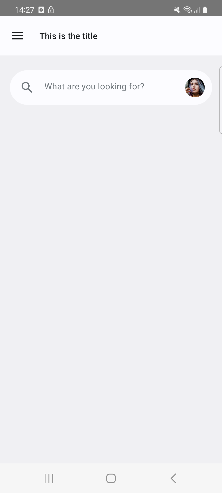

<h1 align="center">Search</h1>

<div align="center">
  
</div>
<br>

## Usage

Examples are in the [source code](../../example/src/main/java/bluevelvet/composents/example).

```kotlin
ComposentsSearchBar(
    modifier = Modifier.fillMaxWidth(),
    tailingContent = {
        ProfileImage(
            drawableResource = R.drawable.avatar_1,
            description = "Profile image of user 1",
            modifier = Modifier
                .padding(12.dp)
                .size(32.dp)
        )
    }
) { searchedText ->
    Log.d("Tag", searchedText)
}
```
