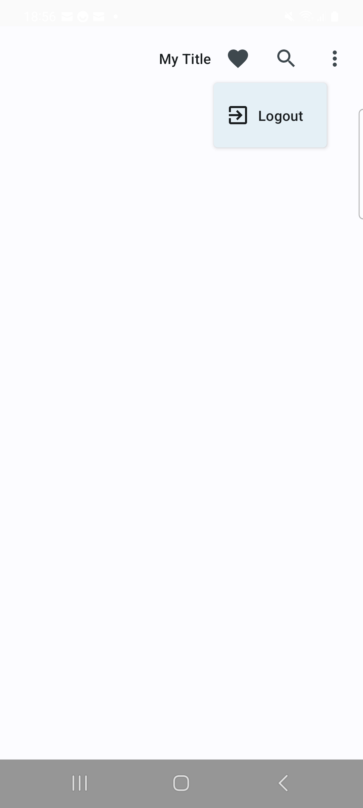

<h1 align="center">Toolbar with overflow menu items</h1>

<div align="center">
  
</div>
<br>

This repo is a jetpack compose library to easily create a toolbar with overflow menu items

## Getting Started
[](https://jitpack.io/#mo0rti/compose-components)
[](https://www.repostatus.org/#active)
[](https://developer.android.com/jetpack/androidx/releases/compose-foundation#1.3.0)

## Usage

Examples are in the [source code](../../example/src/main/java/bluevelvet/composents/example/HomeActivity.kt).

```kotlin
private val favoriteMenu = ComposentMenuItem(title = "Favorite", icon = Icons.Outlined.Favorite)
private val searchMenu = ComposentMenuItem(title = "Search", icon = Icons.Filled.Search)
private val exitMenu = ComposentMenuItem(title = "Logout", icon = Icons.Filled.ExitToApp)

Scaffold(
    topBar = {
        ComposentTopAppBar(
            "My Title",
            menuItems = menuItems,
            overflowMenuItems = overflowMenuItems,
        ) {
            when (it.id) {
                favoriteMenu.id -> {}
                searchMenu.id -> {}
                exitMenu.id -> {
                    startActivity(Intent(this, LoginPinViewActivity::class.java))
                }
            }
        }
    }
)
```


## Parameters

| Property                            | Type                      | Default      | Description                                                |
|-------------------------------------|---------------------------|--------------|------------------------------------------------------------|
| title | `String`                  | empty String | Title to be shown on App bar                               |
| menuItems                           | `List<ComposentMenuItem>` | emptyList()  | Menu items should be visible on app bar                    |
| overflowMenuItems | `List<ComposentMenuItem>` | emptyList()  | Menu items should be visible on overflow menu              |
| onMenuItemClick | `Callback`                |              | Callback to detect which menu item has been tapped by user |

<br/>
