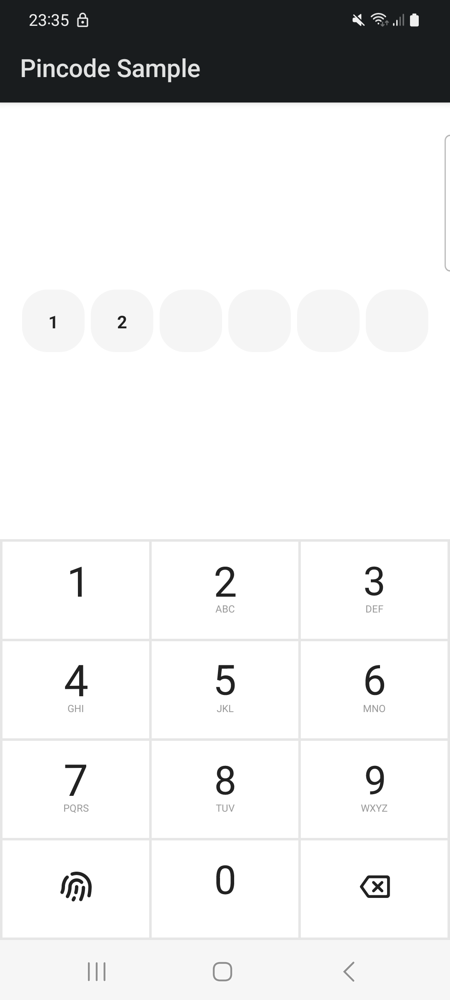

<h1 align="center">Pin Code with Numeric Pad</h1>

<div align="center">
  
</div>
<br>

This repo is a jetpack compose library to ask user for a pin code and display it on boxes.

## Getting Started
[](https://jitpack.io/#mo0rti/compose-components)
[](https://www.repostatus.org/#active)
[](https://developer.android.com/jetpack/androidx/releases/compose-foundation#1.3.0)

## Usage

Examples are in the [source code](../../example/src/main/java/bluevelvet/composents/example/MainActivity.kt).

```kotlin
@Composable
fun Usage() {
    var pincode by remember { mutableStateOf("") }

    PinBox(pincode)
    PinPad(pincode) {
        pincode = it.pinCode
        if (it is PinPadResult.EntryFinished) {
            Log.d(tag, "Pincode entry is finished, pincode is $pincode")
        } else {
            Log.d(tag, "Pincode changed to $pincode")
        }
    }
}
```


## Configuration
PinPad and PinBox has configuration to customize the colors and size of the pin boxes and hidden symbol.
Here are the explanation of the configuration:

| Property                            | Type | Default | Description                                                                                                                              |
|-------------------------------------| ---- | ----------- |------------------------------------------------------------------------------------------------------------------------------------------|
| pinLength                           | `Boolean` | 6 | Maximum length for the pin code                                                                                                          |
| PinPadConfiguration.backgroundColor | `Color` | 0xFFE6E6E6 | Back ground color of Pin pad, Pin Box, Pin pad button color is not a part of this configuration                                          |
| PinPadConfiguration.foregroundColor | `Color` | 0xFF999999 | Default state color of hidden symbol and visibile pin code text. Pin pad button alphabet text color is also a part of this configuration |
| PinPadConfiguration.errorColor | `Color` | 0xFFFF6600 | Error state color of hidden symbol and visible pin code text color                                                                       |
| PinBoxConfiguration.isHiddenPin                            | `Boolean` | true | It hides the pin code on pin box                                                                                                         |
| PinBoxConfiguration.boxSize         | `Dp` | 50.dp | Size of each pin box                                                                                                                     |
| PinBoxConfiguration.boxCornerSize                 | `Dp` | 20.dp | Size of corners of each pin box                                                                                                          |
| PinBoxConfiguration.hiddenSymbolSize              | `Dp` | 20.dp | Size of each rounded hidden symbol when the pin code is hidden                                                                           |
| PinBoxConfiguration.loadingIndicatorColor             | `Color` | 0xFFFFEA8F | Color of loading indicator when pin code entry is finished                                                                               |

<br/>


Passing the configuration is not mandatory, but to customize the component you can pass it to both `PinBox` and `PinCode`

```kotlin

    with(Configuration(maxLength = 4)) {
        PinBox(pincode = pincode, configuration = this)
        PinPad(pincode = pincode, configuration = this) {
            ...
        }
    }

```

The above code displays 4 `PinBox` instead of 6 (default pin code length) to the user.